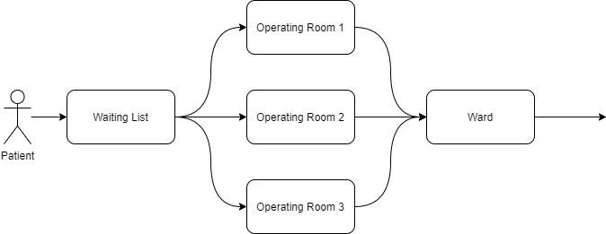
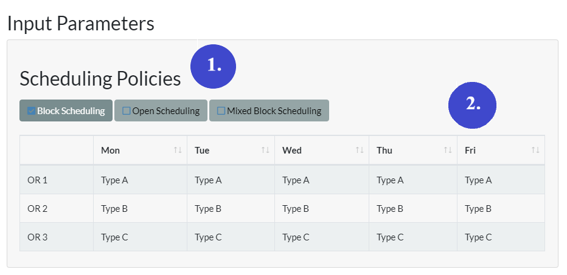

# Manual Page
This page introduces the game and gives a manual on how to play it as a [player](#Player) as well as an [operator](#Operator). Section 1 describes the players view on the game, while Section 2 describes the operators possibilities to influence the game. 
## Introduction
This application is a simulation based educational tool with the goal of teaching the effects different appointment scheduling policies of the Operating Room can have. Thereby the game can be played by two players, *Player A* and *Player B*, or as a single player that controls both *Player A* and *Player B* to compare different policies with each other. Besides the role of the player, there is the role of an operator, who controls the settings of the game. 

The simulation is build up of a waiting list, the three operating rooms and a subsequent ward. Patients arrive to the waiting list in which they wait to be assigned to an operating room based on the schedule policy and schedule given by the player. After being operated the patients have to visit the ward to recover from the surgery. After their time at the Ward the patients will leave the system and go home. The Patients can be of different surgery types A, B or C. The challenge of this game is to choose the scheduling policy and schedule for the operating room that has the best impact on the performance measures and to explore with multiple or single players different scenarios. 

## Section 1: How to play the game 
### 1.1 Game Inputs
As a Player you can mainly change two inputs present in the players page and in the following Figure. 

#### Input 1: Scheduling Policy
The first input is a decision to be made about which scheduling policy to apply. Three Scheduling Policies are available: **Block Scheduling, Open Scheduling** and **Block Scheduling**. Clicking on any of these policies will trigger a notification, that describes these policies shortly (notifications can be disabled on the players page). The following text will describe these policies in more detail:
##### ***Open Scheduling***
The open scheduling policy allows every type of patient (A,B and C) to schedule in any time block available. So the scheduling follows a first come first served policy without any consideration of the different types. For example, an open scheduling policy for operating room 1 means that if Patient 1 of Type A and Patient 2 of Type C is waiting for an appointment, both will be scheduled on the same day if enough time is available. 
##### ***Block Scheduling***
The block scheduling policy only allows patients of a specific type to be scheduled in predefined time blocks. The predefined time blocks have a length of 1 day and are presented with pre filled values in the input schedule (Input 2 in the Figure). For example in this Figure, on Monday only patients of type A can be scheduled for the operating room 1, only patients of type B are scheduled for operating room 2 and only patients of type C are scheduled for operating room 3. 
##### ***Mixed Block Scheduling***
The Mixed block scheduling policy combines both open and block scheduling policies. In this policy the operating room 1 follows an open scheduling policy while the other operating rooms follow the block scheduling policy. This means that the operating room 1 is accepting any patient type that is waiting while the others only allow the defined patient types per block. 
#### Input 2: Appointment Schedule
The second input represents the appointment schedule that is used in case of the block and mixed block scheduling policies. This schedule appoints to each day of the week (Monday to Friday) and to each operating room a Patient type that should be scheduled in that block. In case of the Mixed Block scheduling policy only the operating room 2 and 3 can be scheduled as operating room 1 follows an open scheduling policy. The patient types can be changed by clicking on the schedule and typing the new patient type into the chosen block. The first day cannot be scheduled with the same patient types  and has therefore to include the different patient types. Notifications will warn the user in cases of invalid inputs or when typos occur. 
### 1.2 Game Outputs
The simulation of the game will run with the defined input settings by pressing the green run button. After the simulation has run, performance measures and explanatory measures will be shown. The goal of this game is to achieve the best performance measures and explore how different policies effect them. 
#### Performance Measures
The performance of the players input will be assessed based on three measures: Access Times, Utilization of operating rooms and Bed shortages at the ward. 
##### ***Access Times***
Access Times are defined as the time between a patient requesting an appointment until the patient is allowed to enter the operating room for surgery. The measures shown include the mean, minimum recorded value, maximum recorded value, the median and the number of patients that were simulated per patient type. 
##### ***Utilization of the Operating Rooms***
The utilization of the operating rooms is defined as the fraction of time the operating room is used for surgery from the overall available operating room time. The applications shows the utilization of the different operating rooms as a decimal number (0.95 corresponding to 95% of the overall time was spent in surgery). 
##### ***Bed Shortages at the Ward***
The bed shortages at the ward are dependent on the defined maximum bed capacity of the ward . The application shows the number of times that the need for beds exceeded the actual max capacity and how high the highest need was. 
#### Explanatory Measures
The following explanatory measures aim to explain the performance measures in more detail: Length of Waiting List, Bed Occupancy in the Ward, Idle time. 
##### ***Waiting List Length***
A line graph plots the length of the waiting list against the simulation time with the aim to explain the access time performance measures. 
##### ***Bed Occupancy in the Ward***
The bed occupancy at the ward is shown as a line graph that maps the simulation time to the bed occupancy. The red line represents the maximum bed capacity of the ward and hence the multitude and magnitude of times the bed occupancy exceeded the capacity can be explored. 
##### ***Idle Time***
The idle time is defined as the fraction of time the operating room was not performing surgery on a patient. A bar chart showcases the idle time of the operating rooms based on the surgical specialty that was assigned in the blocks. For example, a 0.15 idle time for type a means that in all the blocks that were assigned to patient of type A, 15 % were spent idle. This measures goal is to help explain the utilization of the different operating rooms and identify potential bottlenecks in the allocation of specialties to operating rooms and days. 

## Section 2: How to change the game
The operators responsibilities lie in challenging the player in different scenarios to achieve the learning goals. The operator is therefore capable to change some input settings related to the simulation and create a new environment for the player to experiment on and acquire new learning goals. All these additional inputs can be found on the operators page and give the opportunity to change: Service and Arrival Rates, the maximum bed capacity at the ward, the seed used in the simulation and the run time of the simulation. 
##### ***Arrival Rates***
The arrivals follow a poisson distribution with exponential inter-arrival times. The mean inter-arrival times can be changed by the operator. An increase of the mean inter arrival time would imply a longer time between two subsequent arrivals, resulting in overall fewer arrivals. A decrease of the inter-arrival time would imply a shorter time between two subsequent arrivals, resulting in more overall arrivals.
##### ***Service Rates***
The service times in this simulation follow a log normal distribution. The mean of this distribution can be changed by the operator. An increase of the mean implies longer service times for the patients and a decrease smaller service times. 
##### ***Maximum Bed Capacity at the Ward***
The Maximum Bed Capacity at the Ward can be changed by the operator. It is advised to let the simulation run one time prior to asses which capacity could be suitable to set as a max in order to facilitate the learning goal of leveling capacity. 
##### ***Seed Value***
This application uses a [pseudo random number generator](https://en.wikipedia.org/wiki/Pseudorandom_number_generator) that is able to recreate the same sequence of "random" numbers. Using the same seed value with which the algorithm computes these random numbers, ensures that the same sequence occurs again. This means by using the same seed value the same arrival patterns and service times will occur. Changing the seed value implies that the random numbers generated for the arrival and service times will be different from before. The operator has the opportunity to change this seed value to let the player experience the impact of different schedules in the same environment or to let the player be challenged by another environment with different patterns in arrivals and service times. 
##### ***Simulation Run Time***
The run time of the simulation can also be changed to enable more reliable metrics with longer computation time. The default is 200 time units while the maximum time is set at 1000 time units. 

